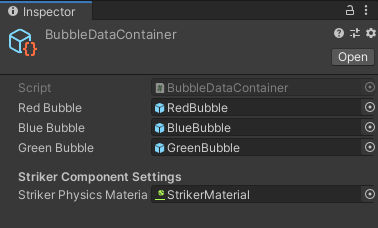
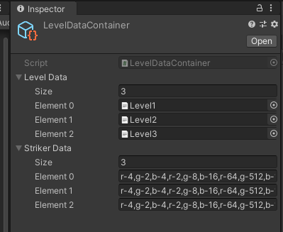

# Bubble Shoot!

  

## Key Features:
* Dependency Injection Framework (Zenject) to resolve dependencies.
* Factory pattern: Zenject Factory for dynamic object creation.
* Model-View-Presenter pattern with reactive extension (UniRX) for data binding. 
* Zenject Signal-based communication between different decoupled systems.
* Usage of UniTask for asynchrony. 
* Pixel art and 8-bit audio

## Design Choice:
* SOLID Principle
* Factory pattern
* Event-Driven based on Domain of classes
* Less MonoBehaviours ( only for view elements)
* No co-routine, lightweight UnitTask, and UniRx for the solution. 

## Project Entry Point (Assets/Resources/Installers): 
### Project Context Installer: 
The persistent data access for creating bubble graphs and audio controller related container.
### Menu Scene Installer:
Menu related dependency container.
### Game Scene Installer:
Game Scene related dependency container. Hosts signal, factory for game scenes.

## Tools for Designers
### Bubble Data Container(Assets/Resources/BubbleData)
Replace bubble images and phyiscs behavior.

  

### Level Data Container(Assets/Resources/LevelData)

  

#### Level Data: Text file to contain grid information. 
Grid data is consists of color and initial node value
colors are 
'r' = Red, 'g' = Green, 'b' = "Blue"
Each bubble of information is separated by a comma.
The new row in the grid is represented by a new line.
The number should be power of 2. Such as r-2,b-8 etc.
#### Striker Data: trikers are sequentially loaded from striker data string arrays for each of the levels.

## Key Implementation approach:
### Level Data Loading
The information of the level data is loaded in the LevelDataContext inside the Project Context installer . Main Menu takes input from the current level. 
### Bubble and Striker Factory:
#### BubbleFactory: 
Following MVP pattern, the BubbleFactory creates BubbleNodes while initializing Nodes from data context. 
* IBubbleNodeController provides abstraction for BubbleNodeController class. 
* BubbleNodeModel contains data information such as BubbleType, and reactive property NodeValue to provide binding with BubbleNodeView ValueText Component.
* BubbleNodeView is the mono behavior that contains physics, collider, and renderer-related components.
#### StrikerFactory:
* This factory acts as a wrapper. It uses BubbleFactory to create Nodes and then adds a temporary script Striker View which handles physics-related actions.
* StrikerView is maintained by StrikerController. Once a striker collides with a bubble or the roof, it gets disabled.
### BubbleGraph:
The heart of organizing the Hexagonal grid is BubbleGraph. 
* InitializeAsync organizes the grid
* RemapNeighborAsync uses raycast to map the neighbors to form the neighborhood map for each of the bubbles
There are two signals that this class subscribes
* OnBubbleCollided 
* OnCeilingCollision
For both of these methods, BubbleGraph checks if there is any possibility to merge the bubbles. It performs 3 steps asynchronously, using 3 helper classes
* NumericMergeHelper: Merges the bubbles with the same number
* ColorMergeHelper: Matches color with neighbor bubbles and if there are more than 2 bubbles, it merges and explodes
* IsolationHelper: Removes any set of nodes that are not connected to the ceiling. 
On Each Step, it remaps the neighbors and also checks if the game has reached the winning condition.

